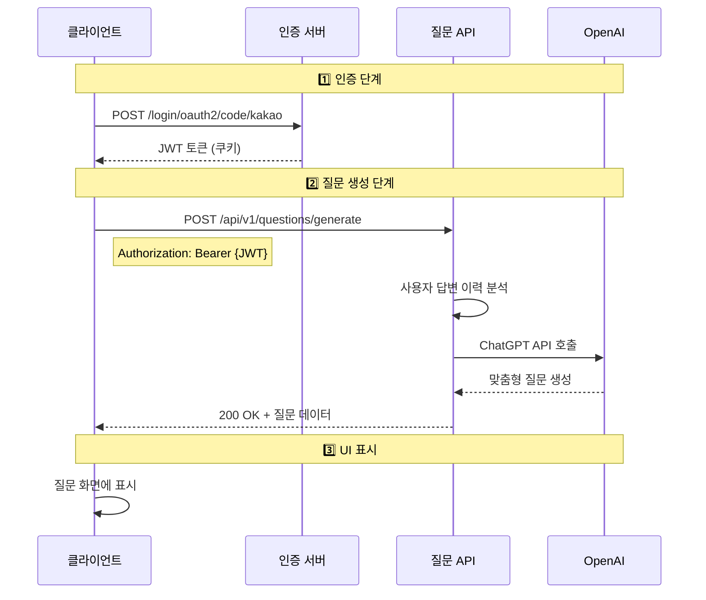

# 🤖 Momento AI 질문 생성 API 사용 가이드

## 📋 개요

Momento의 AI 질문 생성 API는 사용자의 답변 이력을 분석하여 맞춤형 가족 질문을 생성합니다.

## 🔄 전체 API 호출 플로우



## 🚀 단계별 구현 가이드

### 1단계: 카카오 로그인 및 JWT 토큰 획득

#### 1-1. 카카오 로그인 리다이렉트
```javascript
// 카카오 로그인 페이지로 리다이렉트
const KAKAO_AUTH_URL = 'https://dev.caffeineoverdose.shop/oauth2/authorization/kakao';

function loginWithKakao() {
    window.location.href = KAKAO_AUTH_URL;
}
```

#### 1-2. 로그인 콜백 처리
```javascript
// 로그인 성공 후 리다이렉트 URL: /login/oauth2/code/kakao?code={code}
// 서버가 자동으로 JWT를 쿠키에 설정함

// 쿠키에서 토큰 읽기
function getTokenFromCookie() {
    const cookies = document.cookie.split(';');
    for (let cookie of cookies) {
        const [name, value] = cookie.trim().split('=');
        if (name === 'accessToken') {
            return value;
        }
    }
    return null;
}
```

### 2단계: AI 질문 생성 API 호출

#### 2-1. API 호출 함수
```javascript
async function generateAIQuestion() {
    const token = getTokenFromCookie();
    
    if (!token) {
        console.error('로그인이 필요합니다.');
        return;
    }
    
    try {
        const response = await fetch('https://dev.caffeineoverdose.shop/api/v1/questions/generate', {
            method: 'POST',
            headers: {
                'Authorization': `Bearer ${token}`,
                'Content-Type': 'application/json'
            },
            credentials: 'include' // 쿠키 포함
        });
        
        if (!response.ok) {
            throw new Error(`HTTP error! status: ${response.status}`);
        }
        
        const data = await response.json();
        return data;
    } catch (error) {
        console.error('질문 생성 실패:', error);
        throw error;
    }
}
```

#### 2-2. TypeScript 버전
```typescript
interface ApiResponse<T> {
    isSuccess: boolean;
    code: string;
    message: string;
    data: T;
}

interface QuestionResponse {
    question: string;
}

async function generateAIQuestion(): Promise<string> {
    const token = getTokenFromCookie();
    
    if (!token) {
        throw new Error('Authentication required');
    }
    
    const response = await fetch('https://dev.caffeineoverdose.shop/api/v1/questions/generate', {
        method: 'POST',
        headers: {
            'Authorization': `Bearer ${token}`,
            'Content-Type': 'application/json'
        },
        credentials: 'include'
    });
    
    if (!response.ok) {
        const errorData = await response.json();
        throw new Error(errorData.message || 'Failed to generate question');
    }
    
    const data: ApiResponse<string> = await response.json();
    return data.data;
}
```

### 3단계: UI 표시 및 에러 처리

#### 3-1. React 컴포넌트 예시
```jsx
import React, { useState } from 'react';

function QuestionGenerator() {
    const [question, setQuestion] = useState('');
    const [loading, setLoading] = useState(false);
    const [error, setError] = useState(null);
    
    const handleGenerateQuestion = async () => {
        setLoading(true);
        setError(null);
        
        try {
            const generatedQuestion = await generateAIQuestion();
            setQuestion(generatedQuestion);
        } catch (err) {
            setError(err.message);
            
            // 401 에러인 경우 로그인 페이지로 리다이렉트
            if (err.message.includes('401')) {
                window.location.href = '/login';
            }
        } finally {
            setLoading(false);
        }
    };
    
    return (
        <div className="question-generator">
            <button 
                onClick={handleGenerateQuestion} 
                disabled={loading}
            >
                {loading ? '생성 중...' : 'AI 질문 생성'}
            </button>
            
            {error && (
                <div className="error">
                    오류: {error}
                </div>
            )}
            
            {question && (
                <div className="question-card">
                    <h3>오늘의 질문</h3>
                    <p>{question}</p>
                </div>
            )}
        </div>
    );
}
```

#### 3-2. 에러 처리 가이드
```javascript
async function handleApiError(error) {
    if (error.status === 401) {
        // 토큰 만료 - 재로그인 필요
        alert('로그인이 만료되었습니다. 다시 로그인해주세요.');
        window.location.href = '/login';
    } else if (error.status === 404) {
        // 사용자 정보 없음
        alert('사용자 정보를 찾을 수 없습니다.');
    } else if (error.status === 500) {
        // 서버 오류
        alert('일시적인 오류가 발생했습니다. 잠시 후 다시 시도해주세요.');
    } else {
        // 기타 오류
        alert('오류가 발생했습니다: ' + error.message);
    }
}
```

## 📊 API 스펙

### 요청 (Request)

```http
POST /api/v1/questions/generate
Authorization: Bearer {JWT_TOKEN}
Content-Type: application/json

(body 없음)
```

### 응답 (Response)

#### 성공 응답 (200 OK)
```json
{
    "isSuccess": true,
    "code": "COMMON200",
    "message": "성공",
    "data": {
        "id": 123,
        "content": "오늘 가족과 함께한 시간 중 가장 행복했던 순간은 언제인가요?",
        "category": "DAILY",
        "isAIGenerated": true,
        "generatedAt": "2025-01-15T10:30:00"
    }
}
```

#### 에러 응답
```json
{
    "isSuccess": false,
    "code": "USER404",
    "message": "사용자를 찾을 수 없습니다",
    "data": null
}
```

## 📊 주요 기능

### 질문 저장 및 관리
- **DB 저장**: 생성된 질문은 `question` 테이블에 자동 저장
- **사용자 매핑**: `user_question` 테이블에 사용자별 질문 기록
- **카테고리 분류**: AI가 질문 내용을 분석하여 자동 분류
  - MEMORY: 추억 관련
  - DAILY: 일상 관련
  - FUTURE: 미래 계획
  - GRATITUDE: 감사 표현
  - GENERAL: 일반 질문

### 제한 사항
- **일일 한도**: 24시간 내 최대 5개 질문 생성
- **중복 방지**: 7일 내 동일한 질문 자동 필터링
- **AI 모델**: GPT-4 또는 GPT-4o-mini 사용

## 🔐 보안 고려사항

1. **HTTPS 사용**: 모든 API 호출은 HTTPS를 통해 이루어져야 합니다.
2. **토큰 관리**: 
   - 토큰은 HttpOnly 쿠키에 저장됩니다
   - 클라이언트 JavaScript에서 직접 토큰을 조작하지 않습니다
3. **CORS 설정**: 허용된 도메인에서만 API 호출 가능

## 💡 사용 팁

1. **질문 캐싱**: 생성된 질문을 로컬에 저장하여 반복 호출 방지
2. **로딩 상태**: API 호출 중 로딩 인디케이터 표시
3. **재시도 로직**: 네트워크 오류 시 자동 재시도 구현

## 🚨 주의사항

- API는 사용자당 하루 10회로 제한됩니다
- 생성된 질문은 한국어로만 제공됩니다
- 질문 생성에는 평균 2-3초가 소요됩니다

## 📞 문의

API 관련 문의사항은 GitHub Issues에 남겨주세요.
