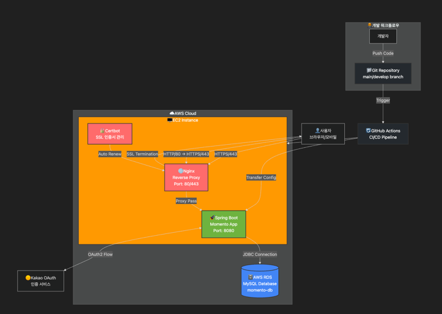
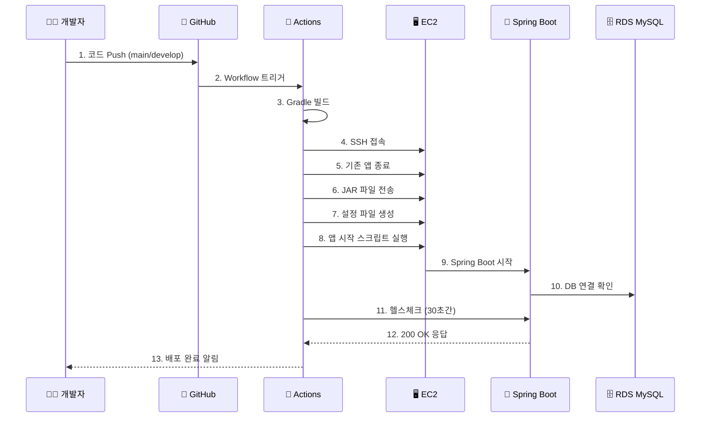

# 🏗️ Momento 프로젝트 아키텍처

## 📋 시스템 개요

Momento는 Spring Boot 3.5.3 + Kotlin으로 개발된 카페인 중독자를 위한 백엔드 서비스입니다. AWS EC2 기반으로 배포되며, GitHub Actions를 통한 CI/CD 파이프라인과
Nginx reverse proxy, SSL 인증서를 통한 HTTPS 보안을 제공합니다.

### 주요 기술 스택

- **Backend**: Spring Boot 3.5.3, Kotlin 1.9.25, JDK 17
- **Database**: AWS RDS MySQL
- **Authentication**: Spring Security + OAuth2 (Kakao)
- **Infrastructure**: AWS EC2, Nginx, Certbot (Let's Encrypt)
- **CI/CD**: GitHub Actions
- **Monitoring**: Spring Boot Actuator

---

## 🎯 아키텍처 다이어그램



---

## 🔧 구성 요소 상세

### 1. 🌐 Nginx Reverse Proxy

**역할**: 웹 서버 및 리버스 프록시

- **포트**: 80 (HTTP) → 443 (HTTPS 리다이렉트), 443 (HTTPS)
- **기능**:
    - HTTP → HTTPS 자동 리다이렉트
    - SSL/TLS 터미네이션
    - Spring Boot 애플리케이션으로 요청 프록시 (포트 8080)
    - 정적 파일 서빙 (필요시)
- **도메인**: `dev.caffeineoverdose.shop`

### 2. 🔒 SSL/TLS 보안 (Certbot)

**역할**: HTTPS 보안 인증서 관리

- **도구**: Let's Encrypt + Certbot
- **자동 갱신**: 인증서 자동 갱신 설정
- **보안 설정**:
  ```yaml
  cookie:
    secure: true        # HTTPS 쿠키만 허용
    same-site: strict   # CSRF 보호 강화
  ```

### 3. 🚀 Spring Boot 애플리케이션

**역할**: 메인 백엔드 애플리케이션

- **포트**: 8080 (내부)
- **프레임워크**: Spring Boot 3.5.3 + Kotlin
- **주요 기능**:
    - REST API 서버
    - OAuth2 인증 (Kakao)
    - JWT 토큰 관리
    - Spring Data JPA
    - Spring Security

### 4. 🗄️ AWS RDS MySQL

**역할**: 데이터베이스

- **엔드포인트**: `momento-db.cvoguymaoqu6.ap-northeast-2.rds.amazonaws.com:3306`
- **데이터베이스**: `momento_db`
- **연결 설정**:
  ```yaml
  hikari:
    maximum-pool-size: 20
    minimum-idle: 5
    connection-timeout: 20000
  ```

### 5. 🔄 GitHub Actions CI/CD

**역할**: 자동 빌드 및 배포

- **트리거**: `main`, `develop` 브랜치 push
- **빌드**: Gradle + JDK 17
- **배포 과정**:
    1. 코드 체크아웃
    2. Gradle 빌드 (`./gradlew clean build -x test`)
    3. JAR 파일 EC2 전송
    4. 설정 파일 생성 및 전송
    5. 애플리케이션 재시작
    6. 헬스체크 (`/actuator/health`)

---

## 🔄 배포 프로세스



### 배포 단계별 세부사항

1. **빌드 단계**
   ```bash
   ./gradlew clean build -x test
   ```

2. **애플리케이션 종료**
   ```bash
   PID=$(pgrep -f "momento.*\.jar")
   kill -15 $PID  # Graceful shutdown
   ```

3. **JVM 최적화 옵션**
   ```bash
   java -jar \
     -Dspring.profiles.active=dev \
     -Xms512m -Xmx1024m \
     -XX:+UseG1GC \
     -XX:MaxGCPauseMillis=200 \
     momento.jar
   ```

4. **헬스체크**
   ```bash
   curl -f -s http://localhost:8080/actuator/health
   ```

---

## 🔐 보안 설정

### 1. HTTPS/SSL 설정

- **프로토콜**: TLS 1.2/1.3
- **인증서**: Let's Encrypt (무료, 자동 갱신)
- **도메인**: `dev.caffeineoverdose.shop`

### 2. OAuth2 인증 (Kakao)

```yaml
oauth2:
  client:
    registration:
      kakao:
        client-id: 7831406ec88574ac2d16c5a3c2445a28
        redirect-uri: https://dev.caffeineoverdose.shop/login/oauth2/code/kakao
```

### 3. JWT 토큰 보안

```yaml
jwt:
  access-token-expiration: 3600000    # 1시간
  refresh-token-expiration: 604800000 # 7일
```

### 4. 쿠키 보안 강화

```yaml
cookie:
  secure: true      # HTTPS만
  http-only: true   # XSS 방지
  same-site: strict # CSRF 방지
```

---

## 📊 모니터링 및 로깅

### 1. Spring Boot Actuator

- **엔드포인트**: `/actuator/health`, `/actuator/info`, `/actuator/metrics`
- **보안**: 인증된 사용자만 상세 정보 접근

### 2. 로깅 설정

```yaml
logging:
  level:
    com.challkathon.momento: INFO
    org.springframework.security: INFO
  file:
    name: /var/log/momento/application.log
```

### 3. 성능 최적화

```yaml
hikari:
  maximum-pool-size: 20
  connection-timeout: 20000
  leak-detection-threshold: 60000

hibernate:
  batch_size: 25
  order_inserts: true
  order_updates: true
```

---

## 🚀 운영 가이드

### 애플리케이션 관리 명령어

```bash
# 애플리케이션 상태 확인
ps aux | grep momento
curl http://localhost:8080/actuator/health

# 로그 확인
tail -f /home/ubuntu/momento/app.log

# 애플리케이션 재시작
cd /home/ubuntu/momento
./start.sh
```

### 트러블슈팅

1. **배포 실패 시**
    - GitHub Actions 로그 확인
    - EC2 인스턴스 접속하여 애플리케이션 로그 확인
    - 헬스체크 엔드포인트 수동 테스트

2. **데이터베이스 연결 오류**
    - RDS 보안 그룹 확인
    - 네트워크 연결성 테스트
    - 커넥션 풀 설정 검토

3. **SSL 인증서 문제**
   ```bash
   sudo certbot renew --dry-run
   sudo nginx -t
   sudo systemctl reload nginx
   ```

---

## 📈 확장 계획

### 1. 단기 개선사항

- **모니터링**: CloudWatch 또는 ELK Stack 도입
- **캐싱**: Redis 추가
- **로드밸런서**: ALB 도입 (다중 인스턴스)

### 2. 장기 확장성

- **컨테이너화**: Docker + ECS/EKS
- **마이크로서비스**: 도메인별 서비스 분리
- **CDN**: CloudFront 도입

---

*📅 최종 업데이트: 2025-06-23*  
*🔄 문서 버전: 1.0*