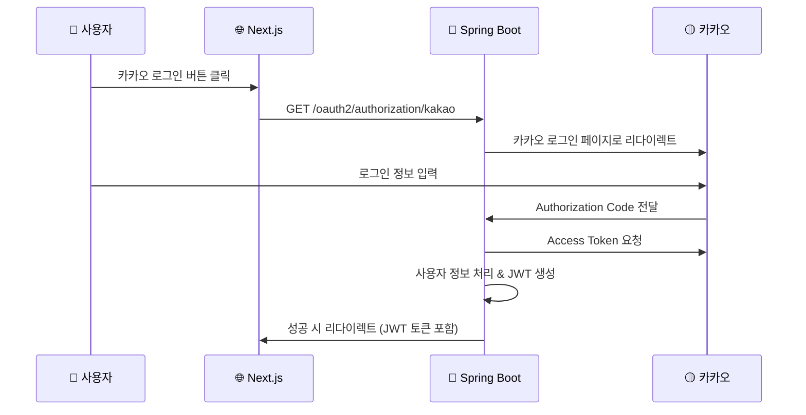

# 🚀 Next.js 소셜 로그인 연동 가이드

## 📋 개요

Spring Boot 백엔드에서 Thymeleaf를 제거하고 REST API 전용으로 최적화 완료! 이제 Next.js에서 소셜 로그인을 구현하기 위한 완전한 가이드입니다.

---

## 🔗 소셜 로그인 URI 정보

### 1. 카카오 소셜 로그인 시작

#### 로컬 환경
```
GET http://localhost:8080/oauth2/authorization/kakao
```

#### 배포 환경  
```
GET https://dev.caffeineoverdose.shop/oauth2/authorization/kakao
```

### 2. 로그인 플로우


---

## 💻 Next.js 구현 코드

### 1. 환경 변수 설정

#### `.env.local`
```env
# Spring Boot 백엔드 URL
NEXT_PUBLIC_API_BASE_URL=http://localhost:8080
# 또는 배포 환경
# NEXT_PUBLIC_API_BASE_URL=https://dev.caffeineoverdose.shop
```

### 2. 카카오 로그인 버튼 컴포넌트

#### `components/auth/KakaoLoginButton.tsx`
```tsx
'use client';

import { useState } from 'react';

interface KakaoLoginButtonProps {
  className?: string;
  children?: React.ReactNode;
}

export default function KakaoLoginButton({ 
  className = "", 
  children = "카카오로 로그인" 
}: KakaoLoginButtonProps) {
  const [isLoading, setIsLoading] = useState(false);

  const handleKakaoLogin = () => {
    setIsLoading(true);
    
    // Spring Boot OAuth2 엔드포인트로 직접 이동
    const apiBaseUrl = process.env.NEXT_PUBLIC_API_BASE_URL || 'http://localhost:8080';
    const kakaoLoginUrl = `${apiBaseUrl}/oauth2/authorization/kakao`;
    
    // 현재 페이지 URL을 저장 (로그인 후 돌아올 페이지)
    if (typeof window !== 'undefined') {
      sessionStorage.setItem('returnUrl', window.location.href);
      window.location.href = kakaoLoginUrl;
    }
  };

  return (
    <button
      onClick={handleKakaoLogin}
      disabled={isLoading}
      className={`
        flex items-center justify-center gap-2 
        bg-yellow-400 hover:bg-yellow-500 
        text-black font-medium py-3 px-6 rounded-lg
        transition-colors duration-200
        disabled:opacity-50 disabled:cursor-not-allowed
        ${className}
      `}
    >
      {isLoading ? (
        <div className="w-5 h-5 border-2 border-black border-t-transparent rounded-full animate-spin"></div>
      ) : (
        <>
          <KakaoIcon />
          {children}
        </>
      )}
    </button>
  );
}

// 카카오 아이콘 컴포넌트
function KakaoIcon() {
  return (
    <svg width="20" height="20" viewBox="0 0 24 24" fill="currentColor">
      <path d="M12 3C6.48 3 2 6.48 2 10.8c0 2.85 1.94 5.34 4.81 6.59l-1.24 4.58c-.07.27.18.48.43.36L12 18.5c0 0 .33.02.67.02 5.52 0 9.33-3.48 9.33-7.72C22 6.48 17.52 3 12 3z"/>
    </svg>
  );
}
```

### 3. OAuth2 콜백 처리 페이지

#### `app/oauth2/redirect/page.tsx`
```tsx
'use client';

import { useEffect, useState } from 'react';
import { useRouter, useSearchParams } from 'next/navigation';

export default function OAuth2RedirectPage() {
  const router = useRouter();
  const searchParams = useSearchParams();
  const [status, setStatus] = useState<'loading' | 'success' | 'error'>('loading');
  const [message, setMessage] = useState('로그인 처리 중...');

  useEffect(() => {
    const handleOAuth2Callback = async () => {
      try {
        // URL 파라미터에서 토큰과 상태 확인
        const token = searchParams.get('token');
        const success = searchParams.get('success');
        const error = searchParams.get('error');

        if (error) {
          setStatus('error');
          setMessage(`로그인 실패: ${error}`);
          return;
        }

        if (success === 'true' && token) {
          // 토큰을 안전하게 저장
          localStorage.setItem('accessToken', token);
          
          // 사용자 정보 가져오기 (선택사항)
          await fetchAndStoreUserInfo(token);

          setStatus('success');
          setMessage('로그인 성공! 이동 중...');
          
          // 이전 페이지로 돌아가거나 메인 페이지로 이동
          const returnUrl = sessionStorage.getItem('returnUrl');
          sessionStorage.removeItem('returnUrl');
          
          setTimeout(() => {
            router.push(returnUrl || '/dashboard');
          }, 1500);
          
        } else {
          setStatus('error');
          setMessage('로그인 처리 중 오류가 발생했습니다.');
        }
      } catch (error) {
        console.error('OAuth2 콜백 처리 오류:', error);
        setStatus('error');
        setMessage('로그인 처리 중 오류가 발생했습니다.');
      }
    };

    handleOAuth2Callback();
  }, [searchParams, router]);

  const fetchAndStoreUserInfo = async (token: string) => {
    try {
      const apiBaseUrl = process.env.NEXT_PUBLIC_API_BASE_URL || 'http://localhost:8080';
      const response = await fetch(`${apiBaseUrl}/api/user/me`, {
        headers: {
          'Authorization': `Bearer ${token}`,
          'Content-Type': 'application/json',
        },
        credentials: 'include',
      });

      if (response.ok) {
        const userInfo = await response.json();
        localStorage.setItem('user', JSON.stringify(userInfo));
      }
    } catch (error) {
      console.error('사용자 정보 조회 실패:', error);
      // 사용자 정보 조회 실패해도 로그인은 성공으로 처리
    }
  };

  return (
    <div className="min-h-screen flex items-center justify-center bg-gray-50">
      <div className="max-w-md w-full space-y-4 p-6">
        <div className="text-center">
          {status === 'loading' && (
            <div className="animate-spin rounded-full h-12 w-12 border-b-2 border-blue-600 mx-auto"></div>
          )}
          
          {status === 'success' && (
            <div className="w-12 h-12 bg-green-100 rounded-full flex items-center justify-center mx-auto">
              <svg className="w-6 h-6 text-green-600" fill="none" stroke="currentColor" viewBox="0 0 24 24">
                <path strokeLinecap="round" strokeLinejoin="round" strokeWidth={2} d="M5 13l4 4L19 7" />
              </svg>
            </div>
          )}
          
          {status === 'error' && (
            <div className="w-12 h-12 bg-red-100 rounded-full flex items-center justify-center mx-auto">
              <svg className="w-6 h-6 text-red-600" fill="none" stroke="currentColor" viewBox="0 0 24 24">
                <path strokeLinecap="round" strokeLinejoin="round" strokeWidth={2} d="M6 18L18 6M6 6l12 12" />
              </svg>
            </div>
          )}
        </div>
        
        <p className="text-center text-gray-600 mt-4">{message}</p>
        
        {status === 'error' && (
          <button
            onClick={() => router.push('/login')}
            className="w-full bg-blue-600 text-white py-2 px-4 rounded-lg hover:bg-blue-700 transition-colors"
          >
            로그인 페이지로 돌아가기
          </button>
        )}
      </div>
    </div>
  );
}
```

### 4. 인증 Context 및 Hook

#### `contexts/AuthContext.tsx`
```tsx
'use client';

import { createContext, useContext, useEffect, useState, ReactNode } from 'react';

interface User {
  id: number;
  email: string;
  username: string;
  profileImageUrl?: string;
  role: string;
}

interface AuthContextType {
  user: User | null;
  token: string | null;
  login: (token: string, user?: User) => void;
  logout: () => void;
  isLoading: boolean;
  isAuthenticated: boolean;
}

const AuthContext = createContext<AuthContextType | undefined>(undefined);

export function AuthProvider({ children }: { children: ReactNode }) {
  const [user, setUser] = useState<User | null>(null);
  const [token, setToken] = useState<string | null>(null);
  const [isLoading, setIsLoading] = useState(true);

  useEffect(() => {
    // 클라이언트 사이드에서만 실행
    if (typeof window !== 'undefined') {
      const savedToken = localStorage.getItem('accessToken');
      const savedUser = localStorage.getItem('user');

      if (savedToken) {
        setToken(savedToken);
        
        if (savedUser) {
          try {
            setUser(JSON.parse(savedUser));
          } catch (error) {
            console.error('사용자 정보 파싱 오류:', error);
            localStorage.removeItem('user');
          }
        }
      }
    }
    setIsLoading(false);
  }, []);

  const login = (newToken: string, newUser?: User) => {
    if (typeof window !== 'undefined') {
      localStorage.setItem('accessToken', newToken);
      if (newUser) {
        localStorage.setItem('user', JSON.stringify(newUser));
        setUser(newUser);
      }
    }
    setToken(newToken);
  };

  const logout = () => {
    if (typeof window !== 'undefined') {
      localStorage.removeItem('accessToken');
      localStorage.removeItem('user');
    }
    setToken(null);
    setUser(null);
  };

  const value = {
    user,
    token,
    login,
    logout,
    isLoading,
    isAuthenticated: !!token,
  };

  return <AuthContext.Provider value={value}>{children}</AuthContext.Provider>;
}

export function useAuth() {
  const context = useContext(AuthContext);
  if (context === undefined) {
    throw new Error('useAuth must be used within an AuthProvider');
  }
  return context;
}
```

### 5. API 클라이언트

#### `utils/api.ts`
```typescript
const API_BASE_URL = process.env.NEXT_PUBLIC_API_BASE_URL || 'http://localhost:8080';

class ApiClient {
  private baseURL: string;

  constructor(baseURL: string) {
    this.baseURL = baseURL;
  }

  private getAuthHeaders(): Record<string, string> {
    const token = typeof window !== 'undefined' ? localStorage.getItem('accessToken') : null;
    return {
      'Content-Type': 'application/json',
      ...(token && { Authorization: `Bearer ${token}` }),
    };
  }

  private async request<T>(endpoint: string, options: RequestInit = {}): Promise<T> {
    const url = `${this.baseURL}${endpoint}`;
    
    const config: RequestInit = {
      headers: this.getAuthHeaders(),
      credentials: 'include',
      ...options,
    };

    try {
      const response = await fetch(url, config);

      if (!response.ok) {
        if (response.status === 401) {
          // 토큰 만료 시 로그아웃 처리
          if (typeof window !== 'undefined') {
            localStorage.removeItem('accessToken');
            localStorage.removeItem('user');
            window.location.href = '/login';
          }
          throw new Error('인증이 만료되었습니다.');
        }
        throw new Error(`HTTP Error: ${response.status}`);
      }

      const contentType = response.headers.get('content-type');
      if (contentType && contentType.includes('application/json')) {
        return await response.json();
      }
      
      return response.text() as unknown as T;
    } catch (error) {
      console.error('API 요청 오류:', error);
      throw error;
    }
  }

  async get<T>(endpoint: string): Promise<T> {
    return this.request<T>(endpoint, { method: 'GET' });
  }

  async post<T>(endpoint: string, data?: any): Promise<T> {
    return this.request<T>(endpoint, {
      method: 'POST',
      body: data ? JSON.stringify(data) : undefined,
    });
  }

  async put<T>(endpoint: string, data?: any): Promise<T> {
    return this.request<T>(endpoint, {
      method: 'PUT',
      body: data ? JSON.stringify(data) : undefined,
    });
  }

  async delete<T>(endpoint: string): Promise<T> {
    return this.request<T>(endpoint, { method: 'DELETE' });
  }
}

export const api = new ApiClient(API_BASE_URL);

// 편의 메서드들
export const authApi = {
  getCurrentUser: () => api.get<User>('/api/user/me'),
  logout: () => api.post('/api/auth/logout'),
  refreshToken: () => api.post('/api/auth/refresh'),
};

interface User {
  id: number;
  email: string;
  username: string;
  profileImageUrl?: string;
  role: string;
}
```

---

## 🛠️ 사용 방법

### 1. 기본 로그인 페이지

#### `app/login/page.tsx`
```tsx
import KakaoLoginButton from '@/components/auth/KakaoLoginButton';

export default function LoginPage() {
  return (
    <div className="min-h-screen flex items-center justify-center bg-gray-50">
      <div className="max-w-md w-full space-y-6 p-6">
        <div>
          <h2 className="text-center text-3xl font-extrabold text-gray-900">
            로그인
          </h2>
        </div>
        
        <div className="space-y-4">
          <KakaoLoginButton className="w-full" />
        </div>
      </div>
    </div>
  );
}
```

### 2. Layout에서 AuthProvider 설정

#### `app/layout.tsx`
```tsx
import { AuthProvider } from '@/contexts/AuthContext';

export default function RootLayout({
  children,
}: {
  children: React.ReactNode;
}) {
  return (
    <html lang="ko">
      <body>
        <AuthProvider>
          {children}
        </AuthProvider>
      </body>
    </html>
  );
}
```

### 3. 인증이 필요한 페이지에서 사용

#### `app/dashboard/page.tsx`
```tsx
'use client';

import { useAuth } from '@/contexts/AuthContext';
import { useRouter } from 'next/navigation';
import { useEffect } from 'react';

export default function Dashboard() {
  const { isAuthenticated, isLoading, user, logout } = useAuth();
  const router = useRouter();

  useEffect(() => {
    if (!isLoading && !isAuthenticated) {
      router.push('/login');
    }
  }, [isAuthenticated, isLoading, router]);

  if (isLoading) {
    return <div>로딩 중...</div>;
  }

  if (!isAuthenticated) {
    return null;
  }

  return (
    <div className="min-h-screen bg-gray-50 py-6">
      <div className="max-w-7xl mx-auto px-4 sm:px-6 lg:px-8">
        <div className="bg-white rounded-lg shadow p-6">
          <div className="flex justify-between items-center mb-6">
            <h1 className="text-2xl font-bold text-gray-900">대시보드</h1>
            <button
              onClick={logout}
              className="bg-red-600 text-white px-4 py-2 rounded-md hover:bg-red-700"
            >
              로그아웃
            </button>
          </div>
          
          {user && (
            <div className="bg-gray-50 rounded-lg p-4">
              <h2 className="text-lg font-medium mb-2">사용자 정보</h2>
              <p>이메일: {user.email}</p>
              <p>사용자명: {user.username}</p>
              <p>역할: {user.role}</p>
            </div>
          )}
        </div>
      </div>
    </div>
  );
}
```

---

## 🔧 테스트 및 디버깅

### 1. 로컬 환경 테스트

1. **Spring Boot 서버 실행**:
   ```bash
   ./gradlew bootRun --args='--spring.profiles.active=local'
   ```

2. **Next.js 개발 서버 실행**:
   ```bash
   npm run dev
   ```

3. **카카오 개발자 콘솔 설정**:
   - Redirect URI: `http://localhost:8080/login/oauth2/code/kakao`

### 2. 배포 환경 테스트

1. **환경 변수 설정**:
   ```env
   NEXT_PUBLIC_API_BASE_URL=https://dev.caffeineoverdose.shop
   ```

2. **카카오 개발자 콘솔 추가 설정**:
   - Redirect URI: `https://dev.caffeineoverdose.shop/login/oauth2/code/kakao`

### 3. 디버깅 체크포인트

- ✅ Spring Boot 서버 정상 기동
- ✅ `/oauth2/authorization/kakao` 엔드포인트 접근 가능
- ✅ 카카오 로그인 후 JWT 토큰 URL 파라미터로 전달
- ✅ Next.js 콜백 페이지에서 토큰 정상 수신
- ✅ 로컬 스토리지에 토큰 저장 확인

---

## 📚 주요 엔드포인트 정리

| 엔드포인트 | 메서드 | 설명 |
|-----------|--------|------|
| `/oauth2/authorization/kakao` | GET | 카카오 로그인 시작 |
| `/login/oauth2/code/kakao` | GET | 카카오 콜백 (자동 처리) |
| `/actuator/health` | GET | 서버 상태 확인 |
| `/swagger-ui.html` | GET | API 문서 |

---

**🎉 이제 Next.js에서 완전한 카카오 소셜 로그인을 구현할 수 있습니다!**

*📅 작성일: 2025-06-23*  
*🔄 문서 버전: 2.0 (Thymeleaf 제거 후 REST API 전용)*