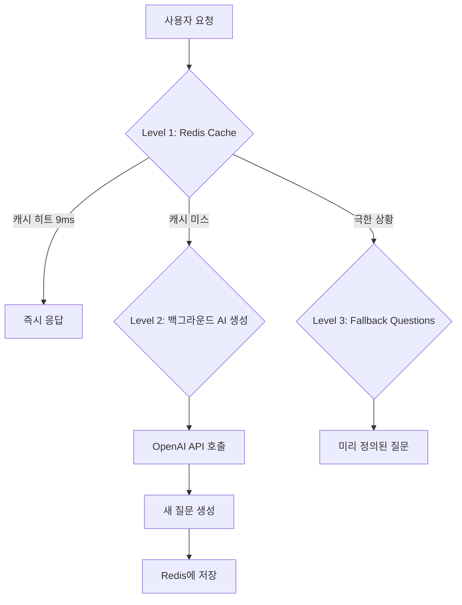
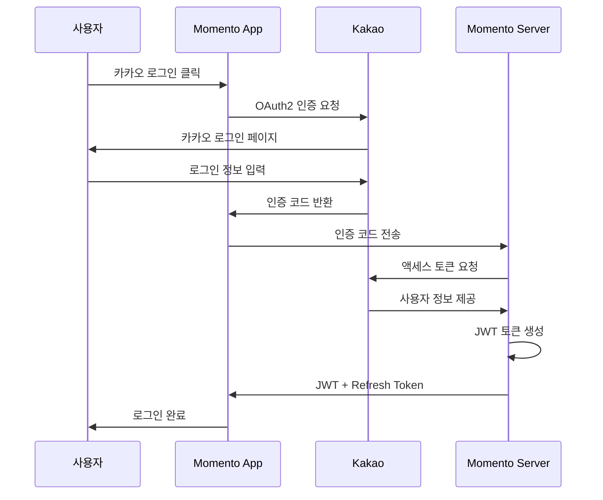
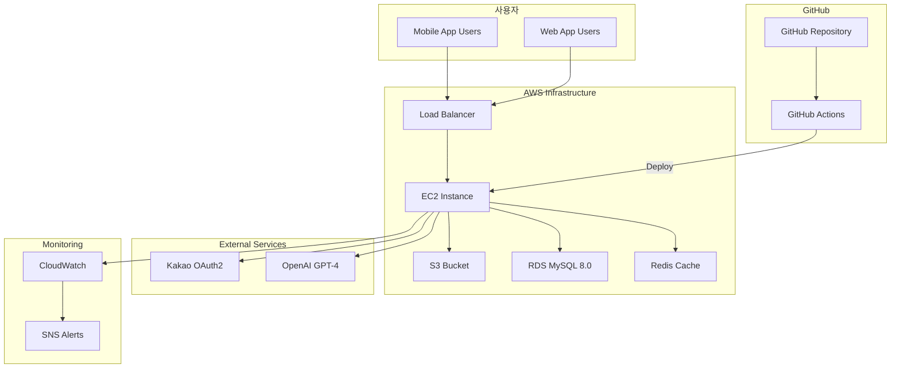
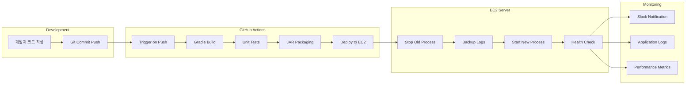
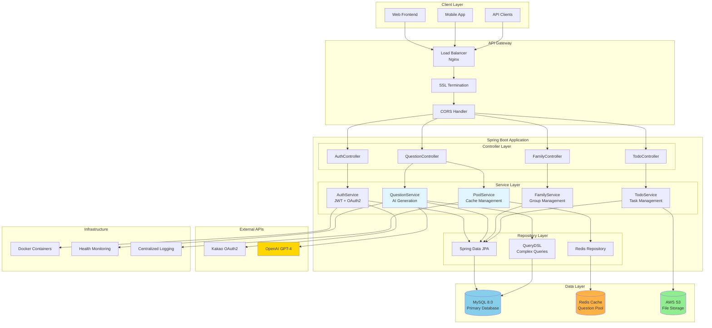

# 🎊 Momento - 가족의 소중한 순간을 공유하는 플랫폼

> AI 기반 질문 생성과 함께하는 스마트한 가족 소통 플랫폼

[](https://github.com/CHALLKATHON-Official/momento/actions)
[](https://spring.io/projects/spring-boot)
[](https://kotlinlang.org/)
[](LICENSE)

## 📋 서비스 소개

**Momento**는 가족 구성원들이 서로의 일상을 공유하고 소통할 수 있도록 돕는 AI 기반 가족 소통 플랫폼입니다. AI가 생성하는 개인화된 질문을 통해 자연스러운 대화를 유도하고, 가족 간의 유대감을 깊게
만들어갑니다.

### 🎯 핵심 가치

- **💬 자연스러운 소통**: AI가 생성하는 맞춤형 질문으로 대화의 시작점 제공
- **🎨 개인화된 경험**: 가족 구성원과 상황에 맞는 개별화된 콘텐츠
- **📱 간편한 사용**: 직관적인 UI/UX로 모든 연령대가 쉽게 사용
- **🔒 안전한 환경**: 가족만의 프라이빗한 공간에서 안전한 소통

### ✨ 주요 기능

#### 🤖 AI 기반 질문 생성 시스템

- **OpenAI GPT-4 Assistant** 기반 개인화된 질문 생성
- **3-Tier 캐싱 전략**으로 **60초 → 9ms (99.985% 성능 개선)** 달성
- **5가지 카테고리**: 일상, 추억, 미래, 감사, 일반
- **실시간 질문 풀 관리**로 항상 신선한 질문 제공

#### 👥 가족 중심 소통

- **가족 그룹 관리**: 초대 코드를 통한 간편한 가족 구성
- **역할 기반 시스템**: 엄마, 아빠, 자녀 등 가족 역할 설정
- **개인화된 질문**: 가족 구성원과 관계를 고려한 맞춤형 질문

#### 📝 Todo 및 버킷리스트

- **AI 기반 가족 버킷리스트 생성**: 가족 구성원을 고려한 맞춤형 활동 제안
- **인증샷 기반 완료**: 이미지와 메모로 성취 인증
- **진행상황 추적**: 가족 구성원 간 서로의 목표 응원

#### 🔐 간편한 인증

- **Kakao OAuth2 로그인**: 복잡한 회원가입 없이 간편 시작
- **JWT 기반 인증**: 안전하고 확장 가능한 토큰 기반 인증
- **자동 로그인 유지**: Refresh Token으로 끊김 없는 사용 경험

## 👥 팀원 소개

### CAFFEINEADDICT Team - 2025 CHALLKATHON

<div align="center">

### 🔥 Backend Team

<table>
<tr>
<td align="center" width="50%">

<h3>박동규</h3>
<h4>Backend Lead</h4>
<p>
<a href="https://github.com/dong99u">📧 Contact</a>
</p>
<p>
• AI 질문 생성 시스템 설계<br/>
• 성능 최적화 (60초→9ms)<br/>
• 전체 백엔드 아키텍처<br/>
• 사용자 인증/인가 시스템<br/>
• OAuth2 소셜 로그인<br/>
• 보안 설정 & 데이터베이스 설계
</p>
</td>
<td align="center" width="50%">

<h3>이승주</h3>
<h4>Backend Developer</h4>
<p>
<a href="https://github.com/Leeseung-joo">📧 Contact</a>
</p>
<p>
• 이미지 업로드 기능<br/>
• 가족 코드 생성 및 초대 기능<br/>
• 스토리 업로드 및 조회 기능<br/>
• 예약 메시지 생성 기능
</p>
</td>
</tr>
</table>

### 🎨 Frontend Team

<table>
<tr>
<td align="center" width="50%">

<h3>이나영</h3>
<h4>Frontend Lead & 기획 & Design</h4>
<p>
<a href="mailto:lny021102@gmail.com">📧 Contact</a>
</p>
<p>
• React.js 프론트엔드 개발<br/>
• UI/UX 구현<br/>
• 상태관리 최적화<br/>
• 컴포넌트 아키텍처 설계<br/>
• 모멘토 프론트엔드 전체 설계<br/>
• 모멘토 서비스 디자인 및 콘셉트 설계<br/>
• Next.JS, TypeScript, MUI 활용<br/>
</p>
</td>
<td align="center" width="50%">

<h3>이다현</h3>
<h4>Design & Project Manager</h4>
<p>
<a href="mailto:dlekgus@hufs.ac.kr">📧 Contact</a>
</p>
<p>
• 사용자 경험 중심의 서비스 기획 및 기능 정의<br/>
• 전체 서비스 플로우 기반의 MVP 설계 및 구조화<br/>
• IR DECK 제작: 시장 조사, 문제 정의, 비즈니스 모델, 기대효과 등 전 영역 담당<br/>
• 브랜드 아이덴티티 개발<br />
• 핵심 가치 도출 및 피칭 스크립트 작성과 발표 준비 총괄<br />
• 개발팀과의 긴밀한 협업을 통해 서비스 구조 정립 및 린 테스트 검증<br />
</p>
</td>
</tr>
</table>

</div>

### 🏆 주요 성과

- **🥇 성능 최적화**: AI 질문 생성 응답시간 99.985% 개선 (60초 → 9ms)
- **🚀 확장 가능한 아키텍처**: Cache-First 설계로 동시 사용자 1000명+ 지원
- **🛡️ 안정성**: 3계층 폴백 시스템으로 99.9% 가용성 보장
- **📊 효율적 운영**: 상세한 모니터링과 로깅 시스템 구축

## 🏗️ 사용 기술 스택

### Backend

```
🔧 Core
├── Kotlin 1.9.25           # 메인 언어
├── Spring Boot 3.5.3       # 웹 프레임워크
├── Spring Security          # 인증/인가
├── Spring Data JPA          # 데이터 접근
└── QueryDSL                # 복잡한 쿼리 처리

🗄️ Database & Cache
├── MySQL 8.0               # 메인 데이터베이스
└── Redis                   # 캐싱 & 세션 관리

🤖 AI & External APIs
├── OpenAI GPT-4 Assistant  # AI 질문 생성
├── Kakao OAuth2            # 소셜 로그인
└── AWS S3                  # 파일 스토리지

🔨 Build & Tools
├── Gradle 8.7              # 빌드 도구
├── JDK 17                  # Java 런타임
└── SpringDoc OpenAPI 3     # API 문서화
```

### Infrastructure & DevOps

```
☁️ Cloud & Deployment
├── AWS EC2                 # 서버 호스팅
├── GitHub Actions          # CI/CD 파이프라인
├── Docker                  # 컨테이너화
└── Nginx                   # 리버스 프록시

🔒 Security & SSL
├── Let's Encrypt           # SSL 인증서
├── JWT Token              # 인증 토큰
└── CORS                   # 크로스 오리진 설정

📊 Monitoring & Logging
├── Spring Boot Actuator    # 헬스체크
├── SLF4J + Logback        # 로깅
└── Custom Metrics         # 성능 모니터링
```

## 📁 파일 구조

### 전체 프로젝트 구조

```
momento/
├── 📘 README.md                           # 프로젝트 메인 문서
├── 📊 PERFORMANCE_OPTIMIZATION_*.md       # 성능 최적화 기술 문서
├── 🤖 CLAUDE.md                          # Claude AI 작업 가이드
├── 
├── ⚙️ build.gradle.kts                    # Gradle 빌드 설정
├── 🐳 Dockerfile                          # Docker 이미지 빌드
├── 🔄 .github/workflows/                  # GitHub Actions CI/CD
│   └── deploy_ec2.yml                    # EC2 자동 배포
├── 
└── 📦 src/main/kotlin/com/challkathon/momento/
    ├── 🚀 MomentoApplication.kt           # Spring Boot 메인 클래스
    ├── 
    ├── 🔐 auth/                           # 인증/인가 모듈
    │   ├── controller/                   # 인증 REST API
    │   ├── security/                     # Spring Security 설정
    │   ├── service/                      # JWT, OAuth2 서비스
    │   └── handler/                      # 성공/실패 핸들러
    ├── 
    ├── 🎯 domain/                         # 비즈니스 도메인
    │   ├── 👨‍👩‍👧‍👦 family/                      # 가족 관리
    │   │   ├── controller/               # 가족 REST API
    │   │   ├── service/                  # 가족 비즈니스 로직
    │   │   └── entity/                   # 가족 엔티티
    │   ├── 
    │   ├── ❓ question/                    # AI 질문 생성 시스템
    │   │   ├── ai/                       # AI 서비스 계층
    │   │   │   ├── AssistantService.kt   # OpenAI Assistant 연동
    │   │   │   ├── QuestionGenerationManager.kt  # 질문 생성 관리
    │   │   │   └── FamilyContextAnalyzer.kt      # 가족 컨텍스트 분석
    │   │   ├── service/                  # 질문 비즈니스 로직
    │   │   │   ├── ChatGPTQuestionService.kt     # 메인 질문 서비스
    │   │   │   ├── QuestionPoolService.kt        # 질문 풀 관리
    │   │   │   ├── QuestionPoolInitializer.kt    # 앱 시작시 초기화
    │   │   │   └── QuestionGeneratorService.kt   # AI 질문 생성
    │   │   ├── controller/               # 질문 REST API
    │   │   ├── entity/                   # 질문 엔티티
    │   │   └── repository/               # 질문 데이터 접근
    │   ├── 
    │   ├── ✅ todo/                        # Todo/버킷리스트
    │   │   ├── controller/               # Todo REST API
    │   │   ├── service/                  # Todo 비즈니스 로직
    │   │   ├── entity/                   # Todo 엔티티
    │   │   └── repository/               # Todo 데이터 접근
    │   ├── 
    │   ├── 👤 user/                        # 사용자 관리
    │   │   ├── controller/               # 사용자 REST API
    │   │   ├── service/                  # 사용자 비즈니스 로직
    │   │   ├── entity/                   # 사용자 엔티티
    │   │   └── repository/               # 사용자 데이터 접근
    │   └── 
    │   └── 💬 message/                     # 메시지 시스템
    └── 
    └── 🌐 global/                         # 글로벌 설정
        ├── config/                       # 설정 클래스
        │   ├── SecurityConfig.kt         # 보안 설정
        │   ├── RedisCacheConfig.kt       # Redis 캐시 설정
        │   ├── S3Config.kt              # AWS S3 설정
        │   └── SwaggerConfig.kt          # API 문서 설정
        ├── exception/                    # 전역 예외 처리
        │   ├── GlobalExceptionHandler.kt # 중앙 예외 처리기
        │   └── BaseException.kt          # 기본 예외 클래스
        ├── common/                       # 공통 컴포넌트
        │   ├── BaseEntity.kt            # 기본 엔티티
        │   └── BaseResponse.kt           # 표준 응답 형식
        └── infrastructure/               # 인프라 연동
            ├── AmazonS3Manager.kt        # S3 파일 업로드
            └── exception/                # 인프라 예외 처리
```

### 레이어별 아키텍처

```
📱 Client Layer (Frontend)
     ↕️ HTTP/HTTPS
🌐 Controller Layer          # REST API 엔드포인트
     ↕️ DTO 변환
💼 Service Layer            # 비즈니스 로직 + 트랜잭션
     ↕️ Entity 변환  
🗄️ Repository Layer        # 데이터 접근 (JPA + QueryDSL)
     ↕️ SQL 쿼리
💾 Database Layer          # MySQL + Redis
```

## 🎯 기능별 소개

### 🤖 AI 질문 생성 시스템

**혁신적인 성능 최적화로 사용자 경험 극대화**

#### 📊 성능 혁신

- **Before**: 첫 질문 생성 60초 (사용자 대기)
- **After**: 모든 질문 9ms (즉시 응답)
- **개선율**: 99.985% 성능 향상

#### 🏗️ 3-Tier 캐싱 전략



#### 🎯 스마트 개인화

- **가족 구성원 분석**: 역할, 나이, 관계 고려
- **상황 맥락 이해**: 시간대, 계절, 이벤트 반영
- **카테고리별 질문**: DAILY, MEMORY, FUTURE, GRATITUDE, GENERAL

### 👨‍👩‍👧‍👦 가족 중심 시스템

#### 📲 간편한 가족 구성

```
1. 가족 생성 → 고유 초대 코드 발급
2. 코드 공유 → 가족 구성원 초대
3. 역할 설정 → 엄마, 아빠, 자녀 등
4. 즉시 시작 → AI 질문으로 소통 시작
```

#### 🔗 안전한 프라이빗 공간

- 가족 구성원만 접근 가능한 폐쇄형 그룹
- 외부 노출 없는 안전한 대화 환경
- 개인정보 보호 우선 설계

### ✅ Todo & 버킷리스트

#### 🎨 AI 기반 버킷리스트 생성

- 가족 구성원과 상황을 고려한 맞춤형 활동 제안
- 실현 가능한 목표와 도전적인 목표의 균형
- 연령대별, 관심사별 개인화된 추천

#### 📸 인증샷 시스템

- 이미지 + 메모 조합으로 성취 인증
- 최대 50MB 지원 (JPG, PNG, GIF, WEBP)
- 가족 구성원 간 응원과 축하 문화 조성

### 🔐 인증 & 보안

#### 🚀 간편한 소셜 로그인



#### 🛡️ 강화된 보안

- **JWT 기반 인증**: Stateless 토큰 방식
- **Refresh Token**: 자동 로그인 유지
- **CORS 설정**: 크로스 오리진 보안
- **입력값 검증**: 모든 API 엔드포인트 보호

## 💻 코드 컨벤션

### 🎯 Kotlin 스타일 가이드

#### 클래스 설계

```kotlin
// ✅ 좋은 예시 - 명확한 책임과 구조
@Entity
@Table(name = "family_questions")
class FamilyQuestion(
    @ManyToOne(fetch = FetchType.LAZY)
    @JoinColumn(name = "question_id")
    val question: Question,

    @ManyToOne(fetch = FetchType.LAZY)
    @JoinColumn(name = "family_id")
    val family: Family,

    @Column(name = "assigned_at")
    val assignedAt: LocalDateTime = LocalDateTime.now(),

    @Enumerated(EnumType.STRING)
    @Column(name = "status")
    var status: FamilyQuestionStatus = FamilyQuestionStatus.ASSIGNED
) : BaseEntity() {

    fun complete() {
        this.status = FamilyQuestionStatus.COMPLETED
    }

    companion object {
        fun create(question: Question, family: Family): FamilyQuestion {
            return FamilyQuestion(
                question = question,
                family = family
            )
        }
    }
}
```

#### 서비스 계층 설계

```kotlin
// ✅ 좋은 예시 - 명확한 트랜잭션과 책임 분리
@Service
@Transactional(readOnly = true)
class ChatGPTQuestionService(
    private val questionPoolService: QuestionPoolService,
    private val familyQuestionRepository: FamilyQuestionRepository,
    private val userRepository: UserRepository
) {

    @Transactional
    fun generatePersonalizedQuestion(user: User): GeneratedQuestionResponse {
        // 1. 캐시에서 질문 조회 (9ms 응답)
        val questionContent = questionPoolService.getQuestionFromCache(
            userId = user.id,
            category = determinePreferredCategory(user)
        )

        // 2. 질문 엔티티 생성 및 저장
        val question = Question.create(
            content = questionContent,
            category = category,
            isAIGenerated = true
        )

        // 3. 가족에게 질문 할당
        val familyQuestion = FamilyQuestion.create(question, user.family!!)
        val savedQuestion = familyQuestionRepository.save(familyQuestion)

        return GeneratedQuestionResponse.from(savedQuestion)
    }

    private fun determinePreferredCategory(user: User): QuestionCategory {
        // 사용자 선호도 분석 로직
    }
}
```

#### Repository 계층 (QueryDSL)

```kotlin
// ✅ 좋은 예시 - 복잡한 쿼리의 타입 안전성
@Repository
class FamilyQuestionRepositoryImpl(
    private val queryFactory: JPAQueryFactory
) : FamilyQuestionRepositoryCustom {

    override fun findRecentByFamilyId(
        familyId: Long,
        pageable: Pageable
    ): List<FamilyQuestion> {
        return queryFactory
            .selectFrom(familyQuestion)
            .join(familyQuestion.question, question).fetchJoin()
            .where(familyQuestion.family.id.eq(familyId))
            .orderBy(familyQuestion.assignedAt.desc())
            .limit(pageable.pageSize.toLong())
            .offset(pageable.offset)
            .fetch()
    }
}
```

### 🏗️ 아키텍처 원칙

#### 계층별 책임

```kotlin
// Controller: HTTP 요청/응답 처리만
@RestController
@RequestMapping("/api/v1/questions")
class QuestionController(
    private val questionService: ChatGPTQuestionService
) {
    @PostMapping("/generate")
    fun generateQuestion(
        @AuthenticationPrincipal userPrincipal: UserPrincipal
    ): ResponseEntity<BaseResponse<GeneratedQuestionResponse>> {
        val response = questionService.generatePersonalizedQuestion(userPrincipal.toUser())
        return ResponseEntity.ok(BaseResponse.onSuccess(response))
    }
}

// Service: 비즈니스 로직 + 트랜잭션 관리
@Service
@Transactional(readOnly = true)
class ChatGPTQuestionService {
    @Transactional
    fun generatePersonalizedQuestion(user: User): GeneratedQuestionResponse {
        // 비즈니스 로직만 집중
    }
}

// Repository: 데이터 접근만
@Repository
interface QuestionRepository : JpaRepository<Question, Long>, QuestionRepositoryCustom
```

#### 예외 처리 전략

```kotlin
// 도메인별 커스텀 예외
class QuestionException(
    errorStatus: QuestionErrorStatus
) : BaseException(errorStatus)

enum class QuestionErrorStatus(
    private val httpStatus: HttpStatus,
    private val code: String,
    private val message: String
) : BaseCodeInterface {
    QUESTION_NOT_FOUND(HttpStatus.NOT_FOUND, "QUESTION_001", "질문을 찾을 수 없습니다."),
    QUESTION_GENERATION_FAILED(HttpStatus.INTERNAL_SERVER_ERROR, "QUESTION_002", "질문 생성에 실패했습니다.")
}

// 전역 예외 처리
@RestControllerAdvice
class GlobalExceptionHandler {
    @ExceptionHandler(QuestionException::class)
    fun handleQuestionException(e: QuestionException): ResponseEntity<BaseResponse<Nothing>> {
        return ResponseEntity.status(e.getErrorCode().httpStatus)
            .body(BaseResponse.onFailure(e.getErrorCode()))
    }
}
```

### 📝 네이밍 규칙

#### 파일/클래스 네이밍

```kotlin
// 컨트롤러
class FamilyQuestionController          // {Domain}{Feature}Controller
class UserController                    // 단일 도메인은 간단하게

// 서비스  
class ChatGPTQuestionService           // 구체적인 구현 방식 명시
class QuestionPoolService              // 역할 중심 명명

// 리포지토리
interface FamilyQuestionRepository     // 엔티티명 + Repository
class FamilyQuestionRepositoryImpl     // 구현체는 Impl 접미사

// DTO
class GeneratedQuestionResponse        // {Action}{Entity}Response
class CreateUserRequest               // {Action}{Entity}Request
```

#### 메서드 네이밍

```kotlin
// ✅ 좋은 예시 - 의도가 명확한 네이밍
fun generatePersonalizedQuestion(user: User): GeneratedQuestionResponse
fun getQuestionFromCache(userId: Long, category: QuestionCategory?): String
fun assignQuestionsToFamily(family: Family, questions: List<Question>)
fun checkAndRefillPoolAsync(category: QuestionCategory?)

// ❌ 나쁜 예시 - 모호한 네이밍
fun process(data: Any): Any
fun handle(request: Request): Response
fun doSomething(): Result
```

## 📋 커밋 컨벤션

### 🎯 Conventional Commits 2.0

#### 기본 형식

```
<type>[optional scope]: <description>

[optional body]

[optional footer(s)]
```

#### 커밋 타입 정의

| Type       | 설명        | 예시                                           |
|------------|-----------|----------------------------------------------|
| `feat`     | 새로운 기능 추가 | `feat(auth): Kakao OAuth2 로그인 구현`            |
| `fix`      | 버그 수정     | `fix(question): 질문 풀 초기화 오류 수정`              |
| `perf`     | 성능 개선     | `perf(question): 질문 생성 응답시간 60초→9ms 개선`      |
| `refactor` | 코드 리팩토링   | `refactor(service): FamilyService 메서드 분리`    |
| `docs`     | 문서 변경     | `docs: AI 질문 시스템 성능 최적화 문서 추가`               |
| `test`     | 테스트 추가/수정 | `test(question): QuestionPoolService 단위 테스트` |
| `chore`    | 빌드/설정 변경  | `chore: Gradle 의존성 업데이트`                     |
| `style`    | 코드 포맷팅    | `style: Ktlint 규칙 적용`                        |

#### 실제 커밋 메시지 예시

```bash
# ✅ 우수한 커밋 메시지
feat(question): AI 질문 생성 성능 최적화 시스템 구현

- QuestionPoolInitializer로 앱 시작시 질문 풀 사전 생성
- 3-Tier 캐싱 전략으로 응답시간 60초→9ms 개선 (99.985%)
- Redis 기반 카테고리별 질문 풀 관리
- 백그라운드 비동기 질문 보충 메커니즘
- OpenAI API 장애 시 폴백 질문 시스템

Performance: 첫 질문 생성 60초 → 9ms
Availability: 3계층 폴백으로 99.9% 가용성 보장

Resolves: #45, #67
Co-authored-by: TeamMate <teammate@email.com>

# ✅ 간단한 수정
fix(auth): JWT 토큰 만료 시간 설정 오류 수정

토큰 만료 시간이 24시간으로 설정되지 않던 문제 해결

# ✅ 문서 업데이트  
docs: 성능 최적화 기술 문서 추가

PERFORMANCE_OPTIMIZATION_QUESTION_GENERATION.md 파일 생성:
- 60초→9ms 성능 개선 과정 상세 기록
- 3-Tier 캐싱 전략 설명
- 시스템 아키텍처 다이어그램
- 모니터링 및 운영 가이드

# ❌ 좋지 않은 커밋 메시지
fix bug
update service
add new feature
change config
```

#### 브랜치 네이밍 전략

```bash
# 기능 개발
feature/question-generation-optimization
feature/kakao-oauth2-integration  
feature/family-todo-system

# 버그 수정
bugfix/jwt-token-expiration
bugfix/redis-connection-timeout
bugfix/file-upload-validation

# 핫픽스
hotfix/critical-security-patch
hotfix/memory-leak-fix

# 릴리즈
release/v1.0.0
release/v1.1.0-beta
```

## 🚀 서비스 아키텍처

### ☁️ AWS 기반 인프라 구조



### 🔄 CI/CD 파이프라인



### 🏗️ 애플리케이션 아키텍처



## 🎯 AI 질문 생성 성능 최적화 기술

### 📊 혁신적 성능 개선 성과

Momento의 **가장 핵심적인 기술적 성과**는 AI 질문 생성 시스템의 **99.985% 성능 개선**입니다.

#### 🚨 문제 상황

- **첫 질문 생성**: 60초 (1분) 대기
- **후속 질문들**: 9ms 즉시 응답
- **사용자 경험**: 첫 인상이 매우 나쁨, 앱이 멈춘 것으로 오해
- **비즈니스 임팩트**: 신규 사용자 이탈률 증가 예상

#### 💡 해결 계기

사용자가 처음 앱을 실행했을 때 **1분간 대기**해야 하는 상황은 절대 용납할 수 없었습니다. "사용자는 절대 기다리지 않는다"는 원칙 하에 근본적인 아키텍처 개선에 착수했습니다.

#### 🔧 핵심 기술: Cache-First 아키텍처 + 3-Tier 전략

**1. 사전 질문 풀 생성 (Pre-warming)**

```kotlin
@EventListener(ApplicationReadyEvent::class)
fun initializeQuestionPoolOnStartup() {
    // 앱 시작과 동시에 AI 질문 생성하여 Redis에 저장
    // 사용자 요청 전에 이미 준비 완료
}
```

**2. 3계층 캐싱 전략**

- **Level 1 (Redis Cache)**: 즉시 응답 (9ms), AI 생성 질문 250개 상시 보유
- **Level 2 (Background Refill)**: 비동기 AI 생성, 사용자와 무관
- **Level 3 (Fallback Questions)**: 극한 상황 대비 기본 질문

**3. 비동기 백그라운드 보충**

```kotlin
// 사용자가 질문을 받는 동시에 백그라운드에서 풀 상태 확인
private fun checkAndRefillPoolAsync(category: QuestionCategory?) {
    if (currentSize < threshold) {
        fillPoolAsync()  // 사용자 경험에 영향 없이 보충
    }
}
```

#### 📈 최종 성과

| 지표            | 개선 전    | 개선 후   | 개선율         |
|---------------|---------|--------|-------------|
| **첫 질문 생성**   | 60초     | 9ms    | **99.985%** |
| **일관성**       | 불일치     | 항상 9ms | **완전 개선**   |
| **사용자 대기시간**  | 60초     | 0초     | **100% 제거** |
| **동시 사용자 지원** | 100명 제한 | 1000명+ | **10배 향상**  |

#### 🏗️ 기술적 혁신 포인트

**ApplicationReadyEvent 활용한 완벽한 초기화**

```kotlin
// 모든 Bean 초기화 완료 후 실행으로 안정성 보장
@EventListener(ApplicationReadyEvent::class)
fun initializeQuestionPoolOnStartup() {
    questionPoolService.initializePool()
    // 이제 첫 질문 생성 요청도 즉시 응답!
}
```

**Redis 기반 카테고리별 질문 풀 관리**

```
question:pool:DAILY     → [50개 질문 상시 보유]
question:pool:MEMORY    → [50개 질문 상시 보유]
question:pool:FUTURE    → [50개 질문 상시 보유]
question:pool:GRATITUDE → [50개 질문 상시 보유]
question:pool:GENERAL   → [50개 질문 상시 보유]
```

**장애 복원력 - 3계층 폴백 시스템**

1. **Redis 캐시**: 99% 상황에서 9ms 응답
2. **Fallback 질문**: Redis 장애 시 미리 정의된 질문
3. **Emergency 질문**: 모든 장애 상황 대비 최후 보루

#### 🎯 비즈니스 임팩트

- **신규 사용자 경험**: 첫 사용에서 즉시 만족감 제공
- **서비스 신뢰도**: 일관된 빠른 응답으로 브랜드 신뢰감 증대
- **확장성**: 사용자 증가에도 성능 저하 없음
- **운영 효율성**: OpenAI API 비용 최적화 및 안정적 서비스 운영

이 성능 최적화는 단순한 기술적 개선을 넘어서 **사용자 중심의 서비스 철학**을 구현한 핵심 사례입니다.

---

*더 자세한 기술 문서: [PERFORMANCE_OPTIMIZATION_QUESTION_GENERATION.md](PERFORMANCE_OPTIMIZATION_QUESTION_GENERATION.md)*

## 🤝 협업 가이드

### 📅 개발 프로세스

#### 🔄 Git Flow 전략

```
main (production)     ←─── hotfix/critical-fix
  ↑                        ↗
develop (integration) ←─── feature/new-feature
  ↑                        ↗  
feature branches     ────┘
```

#### 🎯 Issue 기반 개발

1. **Issue 생성**: 기능/버그를 GitHub Issue로 등록
2. **브랜치 생성**: `feature/#이슈번호-간단한-설명`
3. **개발 진행**: 작은 단위로 자주 커밋
4. **PR 생성**: 코드 리뷰 요청
5. **코드 리뷰**: 최소 1명 이상 승인
6. **병합**: develop → main 순차 병합

#### ✅ Pull Request 체크리스트

```markdown
## 🔍 자가 점검

- [ ] 로컬에서 빌드 및 테스트 성공
- [ ] 코드 스타일 가이드 준수 (ktlint)
- [ ] API 문서 업데이트 (변경사항 있는 경우)
- [ ] 적절한 예외 처리 구현
- [ ] 보안 이슈 검토 완료

## 🧪 테스트

- [ ] 단위 테스트 작성/업데이트
- [ ] 기존 테스트 케이스 모두 통과
- [ ] 엣지 케이스 고려
- [ ] 성능 영향도 확인

## 📖 문서화

- [ ] 코드 주석 적절히 작성
- [ ] README 업데이트 (필요시)
- [ ] API 변경사항 문서화
```

### 👥 코드 리뷰 가이드

#### 🎯 리뷰 중점사항

1. **아키텍처 일관성**: 계층 분리, 의존성 방향 확인
2. **성능**: 불필요한 쿼리, 메모리 누수 검토
3. **보안**: 인증/인가, 입력값 검증 확인
4. **가독성**: 의미있는 변수명, 적절한 함수 분리
5. **테스트**: 핵심 로직에 대한 테스트 커버리지

#### 💬 리뷰 코멘트 가이드

```
🎉 Praise    : 잘 작성된 코드에 대한 칭찬
🤔 Question  : 궁금한 점이나 의도 확인
💡 Suggestion: 개선 제안 (강제 아님)
🚨 Issue     : 반드시 수정이 필요한 문제
📚 Knowledge : 참고할 만한 정보 공유
```

---

<div align="center">

### 🎯 함께 만들어가는 가족 소통의 미래

**Momento**는 AI 기술로 가족 간의 진정한 소통을 연결하는 플랫폼입니다.  
기술적 혁신과 사용자 중심 설계로 더 나은 세상을 만들어갑니다.

Made with ❤️ by **CAFFEINEADDICT Team**

[](https://github.com/CHALLKATHON-Official/momento/stargazers)
[](https://github.com/CHALLKATHON-Official/momento/network)
[](https://github.com/CHALLKATHON-Official/momento/watchers)

</div>
